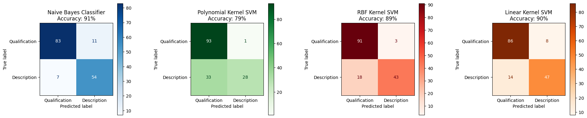
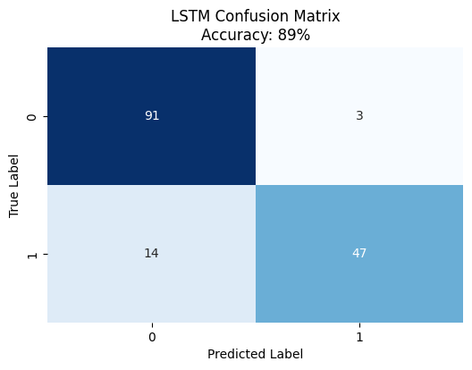
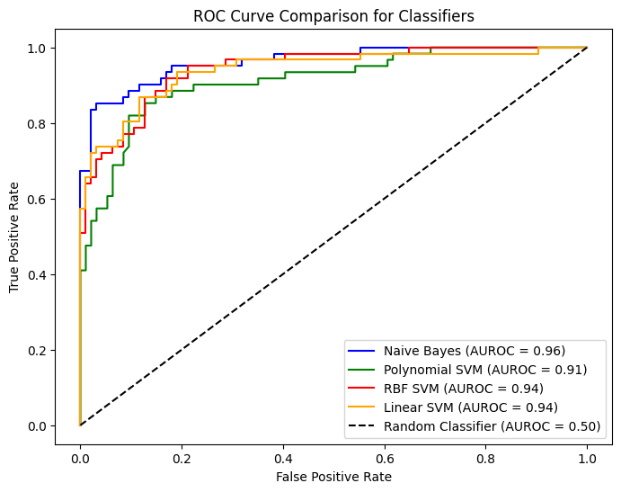
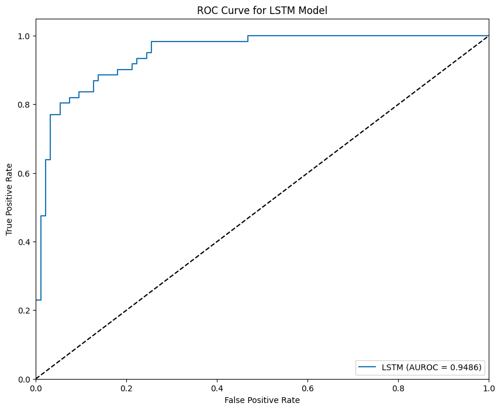
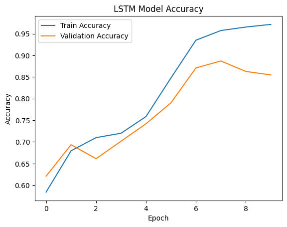

# Tech Mastery Encyclopedia

**Master the skills & Shape your future**  
Stay ready for the future. Discover the skills that matter most and gain the insights to grow and seize new opportunities with confidence. The Tech Mastery Encyclopedia project is dedicated to empowering individuals by identifying in-demand skills through advanced data analysis and machine learning.

# Machine Learning Layer - Classifier Modeling & Text Analysis

This document focuses on the **Machine Learning (ML) part**, a crucial component driving the insights and predictions that form the foundation of this skill-based exploration.

**Explore Other Components**:
- [Visit the Website](#https://techmasteryencyclopedia.com/) - Experience the live application.
- [API Layer](#https://github.com/niharik22/TechMasteryEncyclopedia-API-Layer) - Seamless integration of data and models.
- [Presentation Layer](#https://github.com/niharik22/TechMasteryEncyclopedia-API-Layer) - User-friendly visualizations and dashboards.

---

## Deployment and Automation

The entire ML pipeline, including **data scraping**, **cleaning**, **classification (using the BERT model)**, and **text analysis**, has been **dockerized and deployed to AWS EC2**. Automation is managed using **cron jobs**, which run the full process on a **schedule: 1st and 15th of every month**. This setup ensures that all components of the data pipeline are consistently executed, keeping the insights up-to-date by leveraging cloud infrastructure for efficient and scalable performance.

---

## Table of Contents

1. [Project Highlights](#project-highlights)
2. [Data Collection - Scraping](#data-collection---scraping)
3. [Data Preprocessing](#data-preprocessing)
4. [Classifier Modeling Overview](#classifier-modeling-overview)
5. [Model Performance Visuals](#model-performance-visuals)
6. [Insights](#insights)
7. [Bigram Analysis](#bigram-analysis)
8. [Next Steps](#next-steps)

---

## Project Highlights

- **Data-Driven Skill Discovery**: Uses NLP and ML to analyze job descriptions and identify critical skills.
- **Efficient Data Collection**: Automated scraping with robust error handling to gather data from LinkedIn.
- **Advanced Classification Models**: Implements Naive Bayes, SVM, LSTM, and BERT for high-performance text classification.

---

## Data Collection - Scraping

Automated job description scraping ensures efficient data collection from LinkedIn using Selenium and BeautifulSoup.

### Overview

- **Goal**: Collect job descriptions for analysis.
- **Tools Used**: Python, Selenium, BeautifulSoup
- **Steps**:
  - **Automated Login**: Access job listings securely.
  - **Job Search & Extraction**: Systematically collect job titles, descriptions, and metadata.
  - **Pagination**: Navigate pages to gather comprehensive data.

**Data Collection Summary**:  
_Collected over 10,000 job listings across the United States and Canada for roles such as Data Analyst, Data Engineer, and Software Engineer, covering various states and provinces._

---

## Data Preprocessing

Prepares raw data for analysis by cleaning job descriptions and structuring location details.

### Overview

- **Location Parsing**: Extracts structured data like city, state, and work type.
- **Text Cleaning**: Standardizes and cleans text data to improve ML performance.
- **Sentence Splitting**: Divides descriptions into manageable units for tagging and analysis.

---

## Classifier Modeling Overview

Multiple models were implemented to classify sentences as either "Qualification" or "Description."

### 1. Naive Bayes & SVM Models
- **Naive Bayes**: A baseline model known for its effectiveness in handling text classification.
- **SVM Variants**:
  - **Linear SVM**: A simpler approach that worked effectively for high-dimensional text data.
  - **Polynomial & RBF Kernels**: Tested but exhibited limitations, including overfitting and reduced performance.

**Performance Summary**:
- **Naive Bayes**: _Accuracy: 85%_
- **Linear SVM**: _Accuracy: 87%_
- **Polynomial SVM**: _Accuracy: 79%_
- **RBF SVM**: _Accuracy: 89%_

### 2. LSTM Neural Network
- **Purpose**: Utilized for its ability to understand the sequential nature of text data.
- **Observation**: Achieved improved recall and precision but faced challenges with overfitting, despite using dropout regularization.
- **Accuracy**: _89%_

### 3. BERT Classifier (Best Model)
- **Why Chosen**: BERT excels in capturing the context and meaning of words, making it ideal for text classification tasks.
- **Deployment**: Deployed as the final model due to its superior performance.
- **Accuracy**: _96%_

---

## Model Performance Visuals

The performance of these models was evaluated through confusion matrices, accuracy scores, and AUROC curves. Below are insightful visuals summarizing the key findings:

### Confusion Matrices, AUROC & Accuracy

- **All Models**:
  

- **LSTM Model**:

  
  
- **BERT Model Confusion Matrix**
  
  

---

### ROC Curves

- **All Models**:
  
  
  
- **LSTM Model**:
  
  

---

### LSTM Model Accuracy
- **Training vs. Validation**:
  
  

---

## Insights

- **Best Performing Model**: The BERT model provided the highest accuracy, precision, and recall, making it the ideal choice for deployment.
- **SVM Performance**: Linear SVMs performed well, but non-linear kernels did not add value, demonstrating the limitations of complex models in this context.
- **Naive Bayes**: An effective and reliable baseline but outperformed by deep learning models.
- **LSTM Observations**: While capable of capturing sequential data, faced challenges in maintaining a balance between recall and precision.

---

## Bigram Analysis

Text analysis identifies common bigrams and categorizes relevant keywords into predefined groups such as tools, libraries, languages, skills, and education.

### Methodology

- **Text Cleansing**: Removes punctuation, converts text to lowercase, and filters out stopwords.
- **Bigram Extraction**: Uses NLTK to identify frequent word pairs.
- **Categorization**: Matches bigrams to categories like tools and skills using custom regex patterns.

### Results

The analysis highlighted key trends and frequently mentioned tools, helping to inform skill gap insights and job market trends.

---

**For detailed implementation strategies and code, visit the notebooks**: [Project Notebooks](#notebooks-link)

**Visit the Live Project**: [Link to the Website](#https://techmasteryencyclopedia.com/)
